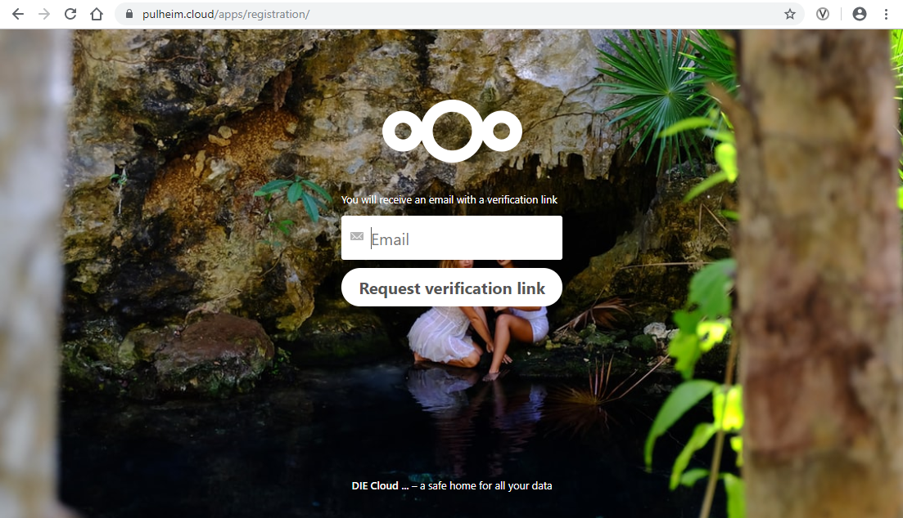

Benutzer
--------

Registrieren
^^^^^^^^^^^^

pulheim.cloud ist ein geschlossenen System. Jeder hat die Möglichkeit, sich zu registrieren. Der Zugriff wird aber immer in letzter Konsequenz von einem Administrator freigegeben oder abgelehnt. Solange eine Registrierung nicht freigegeben ist, lässt das System keinen Login zu. Nach Freigabe durch einen Administrator erhält man eine Email mit einem Link. Wenn man diesem Link folgt, gelangt man auf eine Seite, auf der man dann sein eigenes Passwort spezifiziert.

Passwort
^^^^^^^^

Sobald ein Administrator Ihren Zugriffsantrag (Registrierung) freigeschaltet hat, erhalten Sie eine E-Mail, die einen Link zur Vertigstellung der Registrierung enthält. Folgen Sie bitte diesem Link und wählen Sie einen Benutzenamen und ein Passwort.

Sicherheitfunktionen
^^^^^^^^^^^^^^^^^^^^

Avatar
^^^^^^

Chat
^^^^
