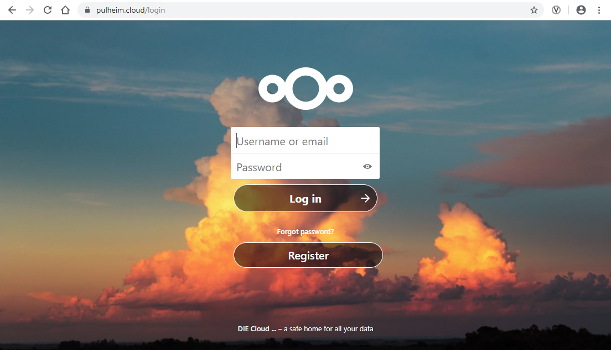

.. PulheimCloud documentation master file, created by
   sphinx-quickstart on Sun Nov 10 18:37:50 2019.
   You can adapt this file completely to your liking, but it should at least
   contain the root `toctree` directive.

Dokumentation: pulheim.cloud
============================

Pulheim.cloud verwendet das Nextcloud System. Diese Dokumentation ist für den Endbenutzer, der entweder als "normaler Benutzer" oder aber als Gruppenadministrator Zugriff hat. Gruppenadministrator ist immer derjenige, der eine Domain betreut. Er ist für die Betreuung seiner Nutzer verantwortlich. Die für den Gruppenadministrator wichtigen Kapitel sind in einer eigens für diese Gruppe erstellten Dokumentation ebenfalls hier im Web veröffentlicht.

Hier wird gezeigt, wie Code interpretiert wird.::

    print 'hello'
    >> hello

Benutzer
--------
Die Dokumentation für Benutzer, angefangen bei der Registrierung über Passwortwechsel, Sicherheit und die *Passwort vergessen* Funktion.

.. toctree::
   :maxdepth: 2

Benutzer

Inhalt
^^^^^^

.. toctree::
   :maxdepth: 2

   Gruppenadministratoren
   Apps

   Lizenz
   Hilfen

Indices and tables
==================

* :ref:`genindex`
* :ref:`modindex`
* :ref:`search`
